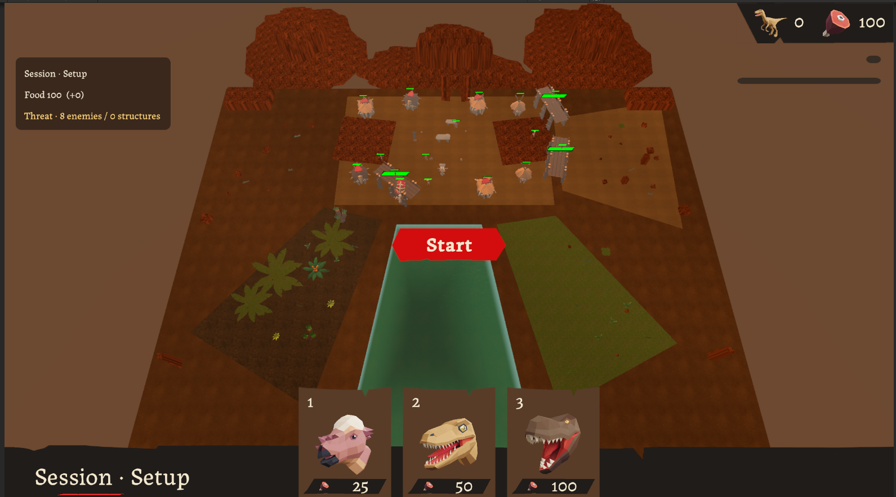
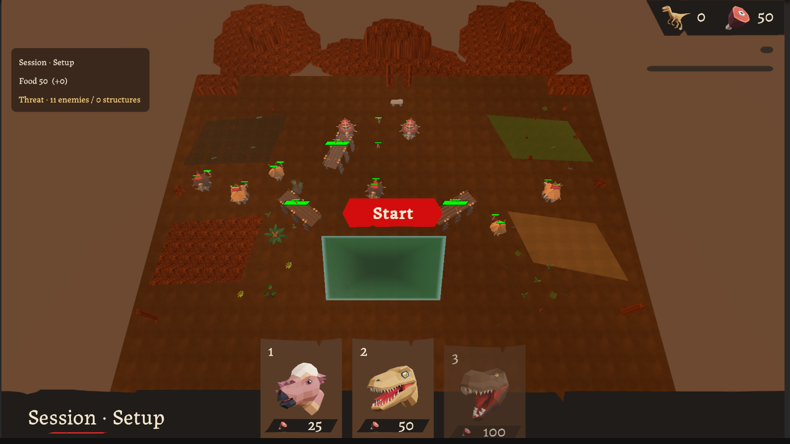
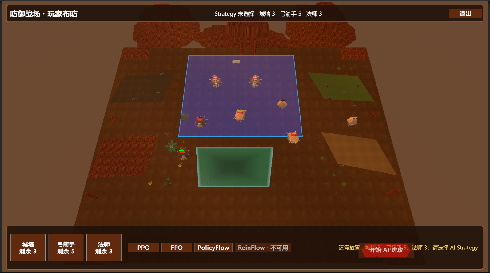
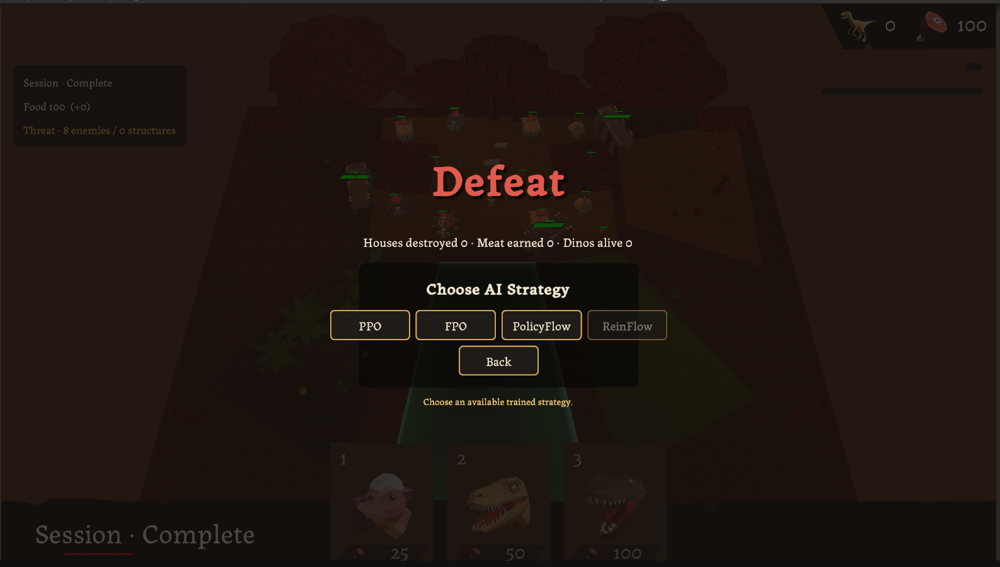
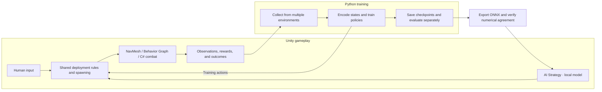

# Dino Attack · Flow RL

[简体中文](README.md) | **English**

**Build a playable battlefield, train AI to decide when, where, and which dinosaurs to deploy, then bring the trained policies back into the game.**

A reverse tower defense project built with Unity 6. Players can deploy dinosaurs to break through defenses, or build their own defenses against an AI attacker. Based on the original Dino Attack, this project adds continuous deployment, a resource loop, and three maps, together with an independent Python / PyTorch training system. Trained **PPO, FPO, and PolicyFlow** policies are available through the in-game AI Strategy menu.

The main work covers **Unity / C# combat systems, game timing and navigation, shared gameplay rules for players and AI, parallel training, and local model inference**. The learned policy makes deployment decisions; navigation and behavior logic control how individual dinosaurs move, find targets, and attack.

[About Flow RL](#flow-rl) · [Game preview](#preview) · [Engineering work](#engineering) · [Models and status](#status) · [Getting started](#quickstart) · [Code and documentation](#resources)

**Play the demo:** [Download the Windows game and training artifacts — v0.1.0](https://github.com/xvchengxvcheng/dino-attack-flow-rl/releases/tag/v0.1.0). Extract the complete game archive and run `Builds/DinoAttack-Windows-20260906/DinoAttack.exe`, keeping its dependencies alongside it. All three AI policies are included; Unity and Python are not required to play. This is a research prerelease; see [validation coverage](docs/VALIDATION.md).

<a id="flow-rl"></a>

## What is Flow RL?

**Reinforcement learning (RL) trains an agent to make decisions through repeated interaction and reward feedback.** Here, the AI observes the battlefield and available resources, then chooses to deploy a dinosaur or wait. The trainer updates the policy using the outcomes of those decisions.

In this project, **Flow RL** refers to reinforcement learning methods that use flow models to generate actions. Starting from an initial vector, a network uses the battlefield state to refine that vector over several internal computation steps, producing one deployment action. Training usually includes random sampling; the current game demo fixes the initial inputs so that the same observation produces a repeatable action. These internal integration steps do not represent multiple gameplay actions.

The project uses PPO as a baseline and explores FPO, ReinFlow, and PolicyFlow, each with its own training objective. The `flow_rl/` Python package contains the algorithms and their training, evaluation, and export tools. PPO, FPO, and PolicyFlow currently run inside the Dino game.

## Current policy limitations and next steps

- **PPO can win, but does not yet fully optimize total reward.** Current gameplay suggests a possible local optimum: it has not consistently learned to attack houses for extra food while retaining more food at victory to earn a higher terminal reward. A high win rate does not establish that the policy maximizes reward.
- **FPO / PolicyFlow remain experimental and need further tuning.** The deployed models often choose to wait at the beginning of a round. Deployment timing and resource use still need improvement. “Experimental” describes the maturity of the models; the game demo itself uses deterministic inference, rather than random exploration actions.
- **A working hypothesis about early waiting:** the current `GAE lambda` may be too small, causing the direct contribution of distant terminal rewards to early-action advantage estimates to decay too quickly. This could weaken their influence on opening decisions. This explanation is **not yet validated**; controlled experiments with different lambda values are needed, alongside checks of value estimates, reward design, and deterministic deployment behavior.

<a id="preview"></a>

## Game preview

| Open battlefield | Layered battlefield · Seeded layouts |
|:---:|:---:|
|  |  |
| **Defense battlefield · Build defenses against AI** | **Three trained AI policies** |
|  |  |

- **Play as the attacker:** continuously deploy Pachycephalosaurus, Velociraptor, and T-Rex units on the open or layered battlefield. Destroy houses to gain food and sustain the attack. The layered battlefield generates layouts from a seed, and an AI can replay the same layout.
- **Play as the defender:** place 3 walls, 5 archers, and 3 mages on the defense battlefield, then select PPO, FPO, or PolicyFlow as the attacker.
- **Round objective:** the attacker wins when a living dinosaur registered in the current round reaches the objective. Combat lasts at most 50 seconds. Deployment requires enough resources, a valid position, and room under the active dinosaur limit.

<a id="engineering"></a>

## Main engineering work

### 1. Shared deployment rules for players and AI

Whether a player clicks the ground or an AI submits an action, deployment follows the same path: **request deployment → validate the request → spend resources and spawn the dinosaur**. Checks cover the current round phase, food balance, deployment regions, ground and navigation validity, and overlap with other objects.

`DinoDeploymentRules` evaluates the rules, the deployment service coordinates validation, and `DinoSpawner.TryDeploy` provides the deployment entry point. Human input, external Python training, and in-game AI therefore use the same gameplay rules.

A round moves through `Setup`, `Running`, `Ending`, and `Ended`. UI controls, gameplay controllers, and result handling respond to these states, with restart support after a round ends.

Code: [Deployment rules](dino-attack/Assets/LlamAcademy/Dinos/Deployment/DinoDeploymentRules.cs) · [DinoSpawner](dino-attack/Assets/LlamAcademy/Dinos/Player/DinoSpawner.cs) · [Round management](dino-attack/Assets/LlamAcademy/Dinos/RoundManagement/RoundManager.cs)

### 2. Target tracking, attacks, and continued movement

Each dinosaur owns its own target list. **Behavior Graph decides what to do, NavMesh handles pathfinding and movement, and custom C# actions execute attacks and damage.**

1. **Detect targets.** Trigger callbacks from `AttackRadius` report nearby objects. `DinoTargetTracker` records living targets, avoids duplicate entries, and subscribes to their death events.
2. **Choose a target and approach it.** The behavior graph reads the target list and selects movement or attack behavior. Its blackboard acts as shared state for targets, the village objective, and attack cooldowns. NavMesh calculates and follows the movement path.
3. **Attack when ready.** Attack actions check that the target is alive, in range, and that the cooldown has elapsed. Delayed hits check the target again when damage is applied, avoiding damage to an already dead object.
4. **Continue after a target dies.** Death events remove targets from the list. The dinosaur can select another living target or resume moving toward the village. Death processing is idempotent, preventing duplicate death events and repeated result handling.

Lifecycle ordering also matters: health is initialized in `Awake`; `Start` establishes detection subscriptions and catches up with targets already inside the trigger; disabling the unit removes subscriptions. When the behavior graph is re-enabled, its target and cooldown data are restored.

Evidence: [Historical combat validation](docs/STATUS.md#evidence).

Code: [Target tracker](dino-attack/Assets/LlamAcademy/Dinos/Unit/DinoTargetTracker.cs) · [Unit lifecycle](dino-attack/Assets/LlamAcademy/Dinos/Unit/Unit.cs) · [Attack action](dino-attack/Assets/LlamAcademy/Dinos/Behavior/AttackClosestObjectAction.cs)

### 3. Game-time progression and navigation readiness

During training, Unity waits for Python to return an action. A slower model increases wall-clock waiting time, so the project distinguishes elapsed real time from simulation progress and checks whether response delays affect combat.

Key combat logic and behavior graphs advance on fixed simulation steps, with coordinated `timeScale` and capture-clock settings. Before combat starts, a readiness gate checks navigation availability and required paths. Movement distinguishes complete, partial, and invalid paths, and only reports arrival when the actual arrival conditions are met.

Historical comparisons held the initial policy and layout seed fixed while changing the delay before Python returned actions. After the navigation readiness work, 19 of 20 episodes had matching outcomes; one still diverged. This is progress toward consistency, not proof of identical step-by-step trajectories.

Evidence: [Timing and navigation investigations](docs/STATUS.md#evidence).

### 4. One geometry definition for visuals, deployment, and AI

The battlefield contains five quadrilateral deployment regions. Region rendering, containment tests, deployment validation, and conversion from AI actions to world coordinates use the same geometry, keeping the visible boundaries aligned with the actual rules.

The three maps provide an open battlefield, a layered battlefield with seeded layouts, and a defense battlefield with player-built layouts. The first two are used for training and evaluation; the third lets players test their defenses against existing policies.

Code and evidence: [Quadrilateral geometry](dino-attack/Assets/LlamAcademy/Dinos/Map/Core/QuadrilateralXZ.cs) · [RuntimeUI](dino-attack/Assets/LlamAcademy/Dinos/UI/RuntimeUI.cs) · [Map validation](docs/STATUS.md#evidence)

### 5. Structured observations and parallel training

The independent `flow_rl` trainer exchanges observations, actions, and rewards with Unity through the **ML-Agents Low-Level API**. All four algorithms were first implemented and validated on the simpler 3DBall environment; PPO, FPO, and PolicyFlow were then connected to Dino's deployment task.

**Handling a variable number of battlefield entities**

Dinosaurs spawn, and walls, defenders, and houses can be destroyed. The number of valid entities therefore changes between decisions. Observations have six groups: global state, regions, walls, defenders, houses, and dinosaurs. The interface reserves capacity for up to 6 walls, 11 defenders, 8 houses, and 10 dinosaurs.

For example, if only 3 dinosaurs are active, their data occupy 3 of the 10 available slots. The remaining slots are zero-padded, and a `valid_mask` identifies which entries should contribute to computation. The six groups contain **270 scalar values** in total, while the number of valid entities varies. The network ignores padding and supports empty entity groups. Its **4-dimensional continuous action** represents a region, two coordinates within that region, and a wait/unit-type choice.

**Network structure: variable entity sets to a fixed-size state representation**

1. **Encode individual entities.** Small MLPs project entity attributes into 48-dimensional features. Entities of the same type share parameters; defense entities also carry type information distinguishing walls, defenders, and houses.
2. **Model relationships.** Set attention uses ISAB blocks for defense entities and SAB blocks for dinosaurs. Remaining game time also conditions the representation, allowing the model to distinguish early-round states from those near the time limit.
3. **Summarize from each deployment region.** The five regions use cross-attention to read defense and dinosaur features. Region features are combined with global state into a **128-dimensional representation**. Reordering entities within a set does not change its meaning; deployment regions retain their individual order.
4. **Choose an action and estimate value.** The actor generates deployment actions, while the critic estimates future cumulative reward. They use the same encoder architecture with independent parameters. PPO uses a Gaussian policy; FPO and PolicyFlow generate actions through flow computations.

**Organizing parallel training**

- **Keep observations and actions correctly matched.** Environment indices, Agent identities, and restart generations identify each interaction. Actions are returned in Unity's requested Agent order.
- **Distinguish natural termination from interruption.** Victory, defeat, and the gameplay time limit are natural outcomes. Process or communication failures can interrupt an episode; the trainer handles these separately when deciding whether to bootstrap future value.
- **Track the policy version behind each action.** Unity environments advance independently while the trainer batches inference. In-flight actions and collected samples retain their generating policy version, preventing old-policy samples from being assigned to a new policy after an update.
- **Preserve resumable state and provenance.** Checkpoints include weights, optimizers, normalization, random states, and version information. Full resume and weights-only warm-start are recorded separately. Unity starts new episodes; the physical world is not restored to its exact pre-interruption state.

The algorithms share environment adapters, rollout storage, return estimation, logging, and evaluation, while retaining their own probability models and training objectives. Algorithm cores follow the official implementations.

Code: [Unity adapter](flow_rl/src/flow_rl/envs/unity.py) · [Parallel environments](flow_rl/src/flow_rl/envs/parallel_unity.py) · [Versioned collector](flow_rl/src/flow_rl/training/versioned_collector.py) · [GAE](flow_rl/src/flow_rl/data/gae.py) · [Set Transformer](flow_rl/src/flow_rl/models/dino_set_transformer.py)

### 6. Deploy trained policies inside the game

A selected PyTorch policy is exported to ONNX and executed locally by Unity Inference Engine / Sentis. Players select the corresponding policy through AI Strategy.

Integration checks cover observation and action compatibility, numerical agreement before and after export, actual model loading and execution in Unity, and correct routing from the strategy-selection UI.

PolicyFlow follows a demonstration-to-RL pipeline: collect 500 successful PPO episodes from each training map, producing **1,000 episodes and 57,459 samples**; train a flow policy through behavior cloning (BC); then fine-tune it with RL. Training and validation are split by whole episodes to avoid leakage. These pretraining costs must be counted when comparing algorithms. Successful episodes can still contain rejected actions; the artifact bundle includes a legal-action coverage report.



Python is needed for training; the game demo uses local models directly. The defense map reuses existing policies, whose performance across diverse player-created layouts has not yet been systematically evaluated.

### 7. Keeping training aligned with normal gameplay

**Training runs the actual Unity game.** Python reads observations, computes actions, and updates models. Unity still handles movement, attacks, damage, resource changes, and outcomes. Human, TrainingAI, and InferenceAI share gameplay scenes and core components; the main difference is who issues deployment requests.

| What is aligned | Implementation |
|---|---|
| **Combat and deployment rules** | All modes use `DinoSpawner.TryDeploy` and share round management, navigation, and combat components. Unity applies unit costs, damage, house food rewards, the 50-second limit, and victory conditions. |
| **Observations and action meanings** | Training and in-game AI use `DinoStructuredObservationBuilder` for six-group observations and `DinoTrainingActionCodec` for four-dimensional actions. Human clicks become deployment requests directly. |
| **Simulation time and decision cadence** | Training and in-game AI make decisions every 25 Academy steps during combat. Remaining time comes from the round's fixed-step count, which does not advance by itself while Python is blocking. Fixed-step gameplay and navigation readiness checks reduce sensitivity to computation speed. Human input remains event-driven. |
| **Outcome source, separate post-round handling** | The game's round manager determines the outcome. Training records rewards and prepares the next episode; normal gameplay displays results. These post-round workflows differ, while the combat outcome comes from the game itself. |
| **Executable and model versions** | Export records model provenance, versions, and hashes. Matching observations are compared across PyTorch, ONNX, and Unity. Updating source or models requires rebuilding the relevant executable; old training Players, the current Editor, and old game builds are not interchangeable. |

Comparing training and in-game behavior requires fixing the **map/layout, executable version, model version, and action-generation mode**. Training typically samples actions, whereas the current game demo uses deterministic actions. Shared rules therefore do not imply identical deployment choices. Validation first compares model outputs for the same observations, then checks time, resources, unit behavior, and outcomes under controlled inputs.

Shared interfaces, combat regressions, export parity checks, and Unity inference have been validated. However, **identical step-by-step trajectories between training and normal gameplay have not been established**. The historical 0/75 ms experiment compared response delays within the training Player; matching 19/20 outcomes does not establish training-to-game trajectory equivalence.

Code and evidence: [Training action entry](dino-attack/Assets/LlamAcademy/Dinos/Training/Runtime/DinoTrainingAgent.cs) · [In-game inference controller](dino-attack/Assets/LlamAcademy/Dinos/Inference/DinoInferenceController.cs) · [Timing and model integration evidence](docs/STATUS.md#evidence)

<a id="status"></a>

## Models and project status

As of **2026-09-06**, the Unity project includes the following models. `step` is the cumulative environment-step count at the checkpoint; training budgets differ between the models.

| Policy | Deployed checkpoint | In-game action generation |
|---|---|---|
| PPO | `step-4721698` | Policy mean followed by tanh to bound the action. |
| FPO | `step-2606819`, policy version 159 | Zero latent input; Euler integration with 4 flow-network evaluations. |
| PolicyFlow | `step-2147452`, policy version 131 | Zero latent and zero added delta; two midpoint integration steps, totaling 4 flow-network evaluations. |

The number of flow-network evaluations, or NFE, contributes to inference cost. All three policies are connected to AI Strategy. FPO uses a selected intermediate checkpoint. PolicyFlow later stopped at `step-3196659`, but the game retains the validated checkpoint above. **ReinFlow is implemented for 3DBall and has not been integrated into Dino.**

The game and three policies are available as a research demo. Remaining research includes strict trajectory consistency, equal-budget comparisons across multiple seeds, Dino ReinFlow, and action chunking. Current training curves and individual evaluations do not establish an algorithm ranking. FPO degradation later in training and early waiting by flow policies remain documented limitations.

### Validation evidence

| Date | Evidence and scope |
|---|---|
| 2026-09-01 | A selected combat and scene regression suite passed 33/33; other acceptance criteria remained open. |
| 2026-09-03 | Navigation readiness and 0/75 ms response-delay comparisons produced matching outcomes in 19/20 episodes, with one remaining divergence. |
| 2026-09-05 | PolicyFlow export parity and actual Unity inference passed; the PPO/PolicyFlow defense-map start and retry tests passed 2/2. Historical full Unity suites still contained failures. |
| 2026-09-06 | Windows x64 build and startup checks passed. EditMode 4/4 and defense-map PPO/FPO/PolicyFlow PlayMode 3/3 passed. A fresh Python environment passed 374 non-integration tests, with 1 skipped and 3 deselected. |
| 2026-09-06 | Frozen training Player: 325 decisions, 4 natural terminals, 0 truncations. All 7 Release assets passed anonymous download/hash verification; extracted checkpoints and the downloaded game passed loading/startup checks. |

These are recorded results, not tests rerun for this translation. **Full manual playthroughs across all three maps and policies, and normal application exit, remain unverified.** See [validation details](docs/VALIDATION.md), [project status](docs/STATUS.md), and [model notes](docs/MODELS.md). Supporting documents are currently in Chinese; this English README covers the main project overview and setup.

<a id="quickstart"></a>

## Getting started

### Play the Windows demo

Download `dino-attack-windows-x64-v0.1.0.zip` from the [v0.1.0 Release](https://github.com/xvchengxvcheng/dino-attack-flow-rl/releases/tag/v0.1.0). Extract the entire archive and run `Builds/DinoAttack-Windows-20260906/DinoAttack.exe`. Keep the `_Data` directory and all runtime dependencies in place. No Python or Unity installation is required to play.

From a cloned repository, the download script can download, verify, and install the game:

```powershell
powershell -ExecutionPolicy Bypass -File scripts/download-artifacts.ps1
```

Add `-All` to install all five artifact bundles: the game, frozen training Player, deployed checkpoints plus Flow BC, successful demonstrations, and selected experiment records. The script checks archive and extracted-file SHA-256 hashes and refuses to overwrite differing existing files.

### Open the Unity project

1. Install **Unity 6000.3.22f1**. Run the dependency script from the repository root before opening `dino-attack/`:

   ```powershell
   powershell -ExecutionPolicy Bypass -File scripts/setup-dependencies.ps1
   ```

   The script fetches the pinned ML-Agents package. The directory layout is:

   ```text
   dino-attack-flow-rl/
   ├── dino-attack/     # Unity game project
   ├── ml-agents/       # Pinned release_23 dependency
   └── flow_rl/         # Python training, evaluation, and export
   ```

2. Open `Assets/LlamAcademy/Dinos/Scenes/MapSelect.unity`, enter Play Mode, and select a map.
3. On maps one and two, click **Start** and deploy dinosaurs; use AI Strategy for a replay after the round. On map three, finish placing defenses, then select **PPO / FPO / PolicyFlow** and start the battle.

In-game inference does not require Python. The Release game includes the deployed policies; the historical FixedClockV5 training executable is distributed separately and is not claimed to have identical dynamics to the new game build.

<details>
<summary>Python environment and training entry points</summary>

The recorded environment uses Python 3.10, PyTorch 2.2.1 + CUDA 12.1, and ML-Agents Python 1.1.0. From the repository root:

```powershell
cd flow_rl
conda env create -f environment.yml
conda activate flow-rl
python -m pip install -r requirements.lock
cd ..
python -m flow_rl.cli.train_dino_parallel_policyflow --help
```

PPO and FPO entry points are `flow_rl.cli.train_dino_parallel_ppo` and `flow_rl.cli.train_dino_parallel_fpo`. Pass a YAML file with `--config`. Training requires a compatible Unity Player and a new output directory. PolicyFlow also requires a compatible BC initialization checkpoint.

After downloading all artifacts, `flow_rl/configs/release_ppo_example.yaml`, `release_fpo_example.yaml`, `release_flow_bc_example.yaml`, and `release_policyflow_example.yaml` provide validated relative-path examples. They preserve their referenced historical parameters and use new output directories; they do not launch training automatically. The FPO example retains an experimental configuration with known stability limitations.

Recent runs used **16 Unity environments**, `timeScale = 1`, and a target rollout size of `16384` transitions per update. Some historical filenames contain obsolete parameter values; use the YAML contents and effective configuration records. Never overwrite an existing run. Resume restores model and optimizer state, not the Unity world's exact physical state.

Further instructions: [Setup](docs/SETUP.md) · [Training and artifact layout](docs/TRAINING.md).

</details>

<a id="resources"></a>

## Code and documentation

| Location | Contents |
|---|---|
| [Unity gameplay](dino-attack/Assets/LlamAcademy/Dinos/) | Deployment, combat, maps, rounds, training bridge, and inference controllers. |
| [External trainer](flow_rl/src/flow_rl/) | Environment adapters, algorithms, data collection, training, evaluation, checkpoints, and export. |
| [Configurations](flow_rl/configs/) | Observation protocol, training settings, and historical experiment configurations. |
| [Deployed models](dino-attack/Assets/Resources/DinoInference/) | Three ONNX models and Unity model configurations. |
| [Project status](docs/STATUS.md) | Delivered capabilities, historical evidence, and outstanding work. |
| [Artifact index](artifacts.json) | Model hashes and Release attachment names, URLs, sizes, and hashes. |

## Upstream project and algorithm sources

The game is based on [LlamAcademy / Dino Attack](https://github.com/llamacademy/dino-attack), retaining its foundational gameplay, unit systems, behavior graphs, navigation, and third-party assets. This project builds on that foundation with the gameplay extensions, combat work, training system, and inference integration described above.

Environment communication uses [Unity ML-Agents](https://github.com/Unity-Technologies/ml-agents). Flow algorithm cores are adapted from their official implementations: [FPO](https://github.com/akanazawa/fpo), [ReinFlow](https://github.com/ReinFlow/ReinFlow), and [PolicyFlow](https://github.com/PolicyFlow2026/PolicyFlow). The project's focus is Unity environment integration, engineering, experimental investigation, and deployment into a playable game.
