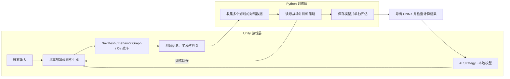

# Dino Attack · Flow RL

**搭建可以亲自游玩的战场，让 AI 学习何时、何地部署哪种恐龙，再把训练好的模型放回游戏。**

这是一个基于 Unity 6 的反向塔防项目：玩家既可以部署恐龙突破防线，也可以布置守军，挑战 AI 的进攻。项目基于原版 Dino Attack，提供持续部署、资源循环和三张地图，并通过独立的 Python / PyTorch 训练系统，将 **PPO、FPO、PolicyFlow** 三种已训练策略接入游戏的 AI Strategy 菜单。

重点工作覆盖 **Unity / C# 战斗实现、游戏时间与导航、玩家和 AI 共用玩法规则、并行训练，以及模型在游戏内运行**。AI 负责全局部署；每只恐龙怎样移动、寻找敌人和攻击，则由游戏中的导航与行为逻辑执行。

[Flow RL 简介](#flow-rl) · [游戏预览](#preview) · [重点工作](#engineering) · [模型与完成状态](#status) · [运行指南](#quickstart) · [源码与文档](#resources)

**直接体验：** [下载 Windows 游戏及训练附件（v0.1.0）](https://github.com/xvchengxvcheng/dino-attack-flow-rl/releases/tag/v0.1.0)。解压游戏包后运行 `Builds/DinoAttack-Windows-20260906/DinoAttack.exe`，保留同目录依赖。三种 AI 已内置，无需安装 Unity 或 Python。首版为研究演示，验证范围见[发布检查](docs/VALIDATION.md)。

<a id="flow-rl"></a>

## Flow RL 是什么？

**强化学习（RL）让 AI 通过反复对局、观察奖励来学习决策。** 在本项目中，AI 读取战场和资源情况，决定部署或等待；训练器根据战斗结果调整模型，使它逐步学会组织进攻。

这里的 **Flow RL** 指使用流模型生成动作的强化学习方法。可以把它理解为：先给出一个初始向量，再由网络结合当前战场，分几小步调整这个向量，最后转换成一次部署指令。训练时通常从随机噪声出发；当前游戏演示固定初始输入，让同一观测下的动作输出可重复。这里的“几步”发生在模型计算内部，最终仍只提交一次动作。

本项目以 PPO 作为基线，探索 FPO、ReinFlow、PolicyFlow 三种 Flow 方法；它们使用不同的训练方式来更新策略。`flow_rl/` 是这些算法及训练、评估、导出工具所在的 Python 包。当前 PPO、FPO、PolicyFlow 已能在 Dino 游戏中运行。

## 当前策略的局限与优化方向

- **PPO：能取得胜利，但尚未充分优化总奖励。** 从当前对局表现看，策略有陷入局部最优的迹象，尚未稳定学会通过攻击房屋获取额外食物，并在获胜时保留更多食物来争取更高的终局奖励。因此，较高胜率不代表已经找到最高奖励策略。
- **FPO / PolicyFlow：模型仍处于探索与调参阶段。** 当前部署模型经常在开局选择等待，部署时机和资源利用仍需进一步优化；这里的“探索阶段”指模型研究尚未收敛，并非游戏内使用随机探索动作。
- **关于开局等待的初步假设：** 当前 `GAE lambda` 可能偏小，使较远的终局奖励对开局动作优势估计的直接贡献衰减较快，从而对开局决策的影响不足。这仍是待验证的推测，不能据此认定等待行为的原因；后续需要调整 `GAE lambda` 做对照实验，并结合价值估计、奖励设计及确定性部署方式检查实际效果。

<a id="preview"></a>

## 游戏预览

| 开阔战场 | 分层战场 · 随机布局 |
|:---:|:---:|
|  |  |
| **防御战场 · 玩家布防，AI 进攻** | **三种已训练 AI 策略** |
|  |  |

- **玩家进攻**：在开阔战场或分层战场持续部署肿头龙、迅猛龙、霸王龙，利用不同兵种突破防线；摧毁房屋获得肉量，继续组织进攻。分层战场使用随机种子（seed）生成布局，也可以让 AI 在相同布局下重赛。
- **玩家布防**：在防御战场布置 3 座墙、5 名弓箭手、3 名法师，选择 PPO / FPO / PolicyFlow，由 AI 发起进攻。
- **单局目标**：存活且已登记在本局中的恐龙抵达目标，进攻方即可获胜；战斗阶段最多 50 秒。部署时需要有足够资源、合法位置，且场上恐龙数量未达到上限。

<a id="engineering"></a>

## 本项目重点工作

### 1. 玩家与 AI 使用同一套部署规则

无论玩家点击地面，还是 AI 发出部署指令，都会经过同一条流程：**提出部署请求 → 检查是否允许 → 扣除资源并生成恐龙**。检查内容包括当前阶段能否部署、肉量够不够、位置是否在允许区域、地面和导航是否有效，以及是否与其他对象重叠。

代码中，`DinoDeploymentRules` 负责规则判断，部署服务组织检查，`DinoSpawner.TryDeploy` 作为部署入口。这样，玩家操作、Python 训练和游戏内 AI 都遵守相同的玩法规则。

一局游戏分为准备（`Setup`）、战斗（`Running`）、结算中（`Ending`）和已结束（`Ended`）四个阶段。按钮、控制器和结算逻辑根据当前阶段工作，结束后可以重新开局。

源码入口：[部署规则](dino-attack/Assets/LlamAcademy/Dinos/Deployment/DinoDeploymentRules.cs) · [DinoSpawner](dino-attack/Assets/LlamAcademy/Dinos/Player/DinoSpawner.cs) · [回合管理](dino-attack/Assets/LlamAcademy/Dinos/RoundManagement/RoundManager.cs)

### 2. 恐龙如何寻找目标、攻击和继续前进

每只恐龙都有自己的目标列表。**行为图（Behavior Graph）决定当前做什么，导航网格（NavMesh）负责寻路移动，C# 攻击节点负责执行攻击和伤害。** 一次战斗按下面的过程进行：

1. **发现目标**：目标进入 `AttackRadius` 的检测范围时，触发碰撞检测回调。`DinoTargetTracker` 记录仍然存活的目标，同一个对象只记录一次，并监听它的死亡消息。
2. **选择目标并靠近**：行为图读取目标列表，决定接下来移动还是攻击。节点之间通过“黑板”共享数据，可以把它理解为一份公共记录，保存目标列表、村庄目标和攻击冷却等信息；需要移动时，由 NavMesh 计算路径并驱动单位前进。
3. **进入范围后攻击**：攻击节点检查目标是否存活、距离是否合适、冷却是否结束，满足条件才执行攻击。需要延迟生效的攻击，会在真正命中前再次检查目标，避免对已经死亡的对象继续施加伤害。
4. **目标死亡后继续行动**：目标死亡会通知追踪器，将自己从列表中移除。恐龙随后可以选择其他存活目标；没有可攻击目标时，继续向村庄前进。死亡处理只执行一次，避免重复触发死亡事件和后续结算。

单位从出生到退场也有明确的处理顺序：`Awake` 初始化生命值，`Start` 建立检测事件订阅，并补上出生时已经处于范围内的目标；单位停用时解除订阅。行为图重新启用后，会重新填入它需要的目标和冷却数据，让单位能够继续行动。

验证记录：[战斗行为验证](docs/STATUS.md#evidence)。

源码入口：[目标追踪器](dino-attack/Assets/LlamAcademy/Dinos/Unit/DinoTargetTracker.cs) · [Unit 生命周期](dino-attack/Assets/LlamAcademy/Dinos/Unit/Unit.cs) · [攻击 Action](dino-attack/Assets/LlamAcademy/Dinos/Behavior/AttackClosestObjectAction.cs)

### 3. 让战斗按游戏时间推进，并在开局前准备好导航

训练时，Unity 需要等待 Python 返回 AI 动作。模型计算越慢，现实中等待的时间就越长，因此需要分清“现实过去了多久”和“游戏推进了多少步”，并检查等待是否会改变战斗行为。

项目用固定的时间步长推进关键战斗逻辑和行为图，并统一训练速度与时间推进配置（`timeScale`、capture clock）。开局前还要等待导航组件准备好、检查必要路径；移动时区分“路径可走到终点”“只能走到一部分”和“没有路径”，只有满足到达条件才认定单位已经抵达。

验证时保持初始模型与地图随机种子相同，只改变 Python 返回动作的等待时间，再比较单位行为和胜负结果。导航就绪处理后的历史对照中，20 局有 19 局结局一致，仍有一局不同，尚未达到每一步都完全一致的要求，目前仍在完善。

证据：[回包等待因果调查](docs/STATUS.md#evidence) · [NavMesh 就绪修复](docs/STATUS.md#evidence) · [capture clock 修正](docs/STATUS.md#evidence)

### 4. 用同一份区域坐标支持地图显示、部署和 AI

战场上有五个四边形部署区域。区域显示、范围检测、部署位置检查，以及 AI 动作到地面坐标的转换，都使用同一份区域坐标，让玩家看到的位置与实际规则保持一致。

三张地图分别提供开阔战场、分层随机布局和玩家自由布防。前两张用于训练与评估，第三张用于体验“自己布防、让已有 AI 来进攻”的玩法。

源码与记录：[四边形几何](dino-attack/Assets/LlamAcademy/Dinos/Map/Core/QuadrilateralXZ.cs) · [RuntimeUI](dino-attack/Assets/LlamAcademy/Dinos/UI/RuntimeUI.cs) · [分层战场验证](docs/STATUS.md#evidence) · [PolicyFlow 地图三回归](docs/STATUS.md#evidence)

### 5. 让 AI 读懂战场，并同时在多个游戏中学习

训练器位于独立的 `flow_rl` Python 包，通过 **ML-Agents Low-Level API** 与 Unity 交换战场信息、动作和奖励。四种算法先在较简单的 3DBall 平衡球环境中完成基础实现与验证，再将 PPO、FPO、PolicyFlow 接入 Dino 部署任务。

**怎样表示数量不断变化的战场对象？**

恐龙会生成，城墙、守军和房屋会被消灭，因此每次决策面对的有效对象数量都可能不同。观测分为全局、区域、城墙、守军、房屋、恐龙六组，接口预留固定容量：最多 6 座墙、11 名守军、8 座房屋、10 只恐龙。

例如，最多能记录 10 只恐龙，而当前只有 3 只，就填入这 3 只的信息，其余位置补零，并用有效性标记（`valid_mask`）告诉网络哪些位置应该参与计算。六组输入合计 **270 个数**，实际有效对象的数量可以变化；网络会忽略填充位置，也能处理一类对象全部消失的情况。最终输出的 **4 个数**分别表示区域、区域内两个坐标，以及等待／兵种选择。

**网络结构：把数量不同的战场对象，转换成固定长度的局势表示。**

1. **先看每个对象**：用小型全连接网络（MLP）把每个对象的信息转换成 48 维特征。同类对象使用同一套参数，防御对象还带有类型标记，用于区分墙、守军和房屋。
2. **再看对象之间的关系**：使用集合注意力（防御对象为 ISAB，恐龙为 SAB），让网络学习应该关注哪些对象、如何结合它们的信息。同时加入剩余游戏时间，使模型能区分开局和临近超时的局势。
3. **从部署区域的角度汇总**：五个区域分别通过交叉注意力读取防御和恐龙信息，形成各区域的局势特征；再与全局状态合并，得到 **128 维表示**。同类对象换个排列顺序不改变集合的含义，五个部署区域则保留各自的顺序。
4. **决定行动、估计收益**：策略网络（Actor）生成部署动作，价值网络（Critic）估计当前局势未来能获得多少累计奖励。两者使用相同的编码器结构、各自独立的参数。PPO 使用高斯策略生成动作，FPO / PolicyFlow 使用 Flow 网络分步生成动作。

**怎样组织并行训练？**

- **把数据对应回正确的游戏和决策者**：多个 Unity 游戏同时运行时，记录环境编号、Agent 身份和重启次数，并按 Unity 请求的顺序发送动作，避免串局或错配。
- **区分正常结束与意外中断**：胜利、失败和游戏超时都有明确结果；进程或通信异常则可能让一局提前中断。训练器分别处理这些情况，计算回报时决定是否还需要估计后续收益。
- **记录动作来自哪个模型版本**：多个游戏各自推进，训练器集中计算动作。每次模型更新前后都追踪尚未返回的动作和采集记录，防止把旧模型生成的数据误当成新模型的数据。
- **保存训练进度和实验依据**：除模型权重外，还保存优化器、数据归一化、随机状态和版本号。完整续训（resume）与只继承权重重新训练（warm-start）分开记录；Unity 对局会重新启动，不会恢复到中断前的物理瞬间。

四种算法共用环境连接、对局记录、回报估计、日志和评估工具，各自保留不同的策略计算与训练规则，核心算法参照官方源码实现。

源码入口：[Unity 适配](flow_rl/src/flow_rl/envs/unity.py) · [并行环境](flow_rl/src/flow_rl/envs/parallel_unity.py) · [版本化采集器](flow_rl/src/flow_rl/training/versioned_collector.py) · [GAE](flow_rl/src/flow_rl/data/gae.py) · [Set Transformer](flow_rl/src/flow_rl/models/dino_set_transformer.py)

### 6. 把训练好的模型放回游戏

选定要用于游戏的模型后，将 PyTorch 模型导出为可被 Unity 读取的 ONNX 文件，再由 Unity Inference Engine / Sentis 在本地计算动作。玩家在 AI Strategy 中选择模型，就可以让它控制部署。

接入时需要确认：输入的战场信息和输出的动作格式一致，导出前后的计算结果接近，Unity 能真正加载并运行模型，游戏按钮也能启动对应策略。

PolicyFlow 采用“先模仿、再自己练习”的训练过程：从 PPO 在两张地图上的成功对局中，各采集 500 局，共得到 1,000 局、57,459 条样本。先通过行为克隆（BC）学习这些动作，再通过强化学习继续调整。训练集与验证集按整局划分，避免同一局的数据同时用于学习和检查效果；这部分预训练开销也要计入实验成本。



图中展示训练到游戏运行的流程。训练时需要 Python；游戏体验直接使用本地模型。地图三复用已有策略，目前尚未系统评估它在各种玩家布局下的表现。

### 7. 训练与正常游玩如何保持一致

**训练时运行的也是实际 Unity 游戏。** Python 负责读取战场、计算动作和更新模型，单位移动、攻击、扣血、资源变化和胜负仍由 Unity 执行。玩家操作（Human）、外部训练（TrainingAI）和游戏内 AI（InferenceAI）使用相同的玩法场景与核心组件，主要替换“谁来发出部署指令”。

一致性从以下几个方面落实：

| 对齐内容 | 具体做法 |
|---|---|
| **同一套战斗规则** | 三种模式都经过 `DinoSpawner.TryDeploy` 部署，并复用回合管理、导航和战斗组件。恐龙价格、伤害、房屋返肉、50 秒时限和胜负条件由游戏侧统一执行。 |
| **同一份战场信息与动作含义** | 训练和游戏内 AI 都使用 `DinoStructuredObservationBuilder` 生成六组观测，再通过 `DinoTrainingActionCodec` 解读四维动作。例如，同一组“区域、坐标、兵种”数值在两边应当表示同一次部署。玩家点击则直接转成部署请求。 |
| **对齐时间与决策节奏** | 训练和游戏内 AI 都在战斗期间按 25 个 Academy step 的间隔决策。回合剩余时间来自本局固定步计数；Python 等待期间不会让这个计数自行增加。配合前述固定步推进和开局导航检查，减少计算快慢对战斗过程的影响。玩家输入仍按实际操作触发。 |
| **共用胜负来源，分别处理结束后的工作** | 游戏回合管理器决定胜负；训练侧据此记录奖励、结束当前训练回合并准备下一局，正常游玩则展示结算界面。训练日志与玩家界面的收尾方式不同，战斗结果沿用游戏本身的判定。 |
| **核对实际运行版本与模型** | 导出时记录模型来源、版本和文件校验值，并检查相同观测在 PyTorch、ONNX 和 Unity 中的输出。游戏代码或模型更新后，需要重新构建对应程序；旧训练程序、当前 Editor 和旧版游戏不能仅凭项目名称就视为相同版本。 |

例如，要比较同一个 AI 在训练程序和游戏内的表现，需要固定**地图与布局、游戏版本、模型版本和动作生成方式**。训练通常带随机探索，当前游戏演示采用确定性动作，因此两者即使遵守同一套规则，也可能选择不同的部署。核对时先给模型相同观测检查动作，再比较固定输入下的游戏时间、资源、单位行为和最终胜负。

目前已有共享接口、战斗回归、导出模型数值对照和 Unity 实际运行的验证证据；但**尚未证明训练与正常游玩在相同输入下每一步都完全一致**。前述 0 / 75 ms 等待实验属于训练程序内部的延迟对照，19/20 局结局一致也不能替代训练端与游戏端的完整轨迹验证。

源码与记录：[训练动作入口](dino-attack/Assets/LlamAcademy/Dinos/Training/Runtime/DinoTrainingAgent.cs) · [游戏内推理控制器](dino-attack/Assets/LlamAcademy/Dinos/Inference/DinoInferenceController.cs) · [游戏时间核对](docs/STATUS.md#evidence) · [历史版本过程对照](docs/STATUS.md#evidence) · [当前 PolicyFlow 模型接入](docs/STATUS.md#evidence)

<a id="status"></a>

## 模型与完成状态

截至 **2026-09-06**，当前 Unity 项目已安装以下模型。`step` 表示保存模型时累计的环境步数，便于对应训练记录；三种模型的训练量并不相同。

| 策略 | 当前部署版本 | 游戏中如何生成动作 |
|---|---|---|
| PPO | `step-4721698` | 使用策略输出的均值，经 tanh 限制到动作范围。 |
| FPO | `step-2606819`，策略版本 159 | 从零向量出发，使用 Euler 积分，调用 Flow 网络 4 次。 |
| PolicyFlow | `step-2147452`，策略版本 131 | 初始向量与附加扰动均设为零，使用 midpoint 积分两步，共调用 Flow 网络 4 次。 |

Flow 网络的调用次数也称为 NFE，是一次动作计算开销的一部分。三种策略均已接入 AI Strategy。FPO 使用训练中途选出的模型；PolicyFlow 后续训练停止于 `step-3196659`，游戏中仍使用上表的已验证版本。**ReinFlow 已完成 3DBall 实现，尚未接入 Dino 游戏。**

游戏和三种 AI 已可演示。后续工作包括：验证相同输入下每一步战斗行为的一致性、在相同训练量和多个随机种子下比较算法、接入 Dino ReinFlow，以及探索一次预测连续多个动作（action chunk）。目前的训练曲线和单次评估还不能给算法排名；FPO 后段表现下降、部分 Flow 策略开局等待较久等现象保留在实验记录中。

### 验证证据

下表为已有报告中的历史结果，本次 README 更新未重新运行项目测试或训练。

| 日期 | 范围与结果 | 证据 |
|---|---|---|
| 2026-09-01 | 战斗行为、场景、AI / 训练入口等选定回归集 33/33 通过；报告另列后续补充验证。 | [战斗修复记录](docs/STATUS.md#evidence) |
| 2026-09-03 | 导航就绪处理后，对比 Python 返回动作前等待 0 / 75 ms 的情况，19/20 局结局一致，仍有一局不同。 | [时序与导航调查](docs/STATUS.md#evidence) |
| 2026-09-05 | PolicyFlow 完成导出前后计算结果对照，并在 Unity 中实际运行；地图三开始流程的 PPO / PolicyFlow 回归测试 2/2 通过。 | [模型接入](docs/STATUS.md#evidence) · [PlayMode 结果](docs/STATUS.md#evidence) |
| 2026-09-05 | 完成情况审计中，Python 测试 372 项通过、1 项失败、3 项未选入；报告引用的 Unity 历史 PlayMode 测试通过 46/59 项，尚未全部通过。 | [完成情况审计](docs/STATUS.md#evidence) |

当前状态与验证范围见[公开状态说明](docs/STATUS.md)。实验分析摘要见[训练曲线与统计口径](docs/STATUS.md#evidence)及[开局等待与奖励敏感性调查](docs/STATUS.md#evidence)。

<a id="quickstart"></a>

## 运行指南

详细步骤见[安装说明](docs/SETUP.md)与[训练说明](docs/TRAINING.md)。本仓库提供源码与部署ONNX，原始训练数据和可执行程序尚未作为附件发布。

### Unity 游戏

1. 使用 **Unity 6000.3.22f1** 打开 `dino-attack/`。先在仓库根目录运行 `powershell -ExecutionPolicy Bypass -File scripts/setup-dependencies.ps1` 获取固定版本的 ML-Agents。项目通过 `Packages/manifest.json` 引用同级 Unity Package，目录关系如下：

   ```text
   game_project/
   ├── dino-attack/     # Unity 游戏工程
   ├── ml-agents/      # release_23，含 com.unity.ml-agents
   └── flow_rl/        # Python 训练、评估与导出
   ```

2. 打开 `Assets/LlamAcademy/Dinos/Scenes/MapSelect.unity`，进入 Play Mode 并选择地图。
3. 地图一、二点击 **Start** 后选择恐龙部署，结算后可使用 AI Strategy 重赛；地图三完成布防，再选择 **PPO / FPO / PolicyFlow** 开始。

游戏内推理不需要 Python 环境。当前源码已包含 PolicyFlow；旧版可执行文件需要重新构建，才能包含新模型与对应路由修复。

<details>
<summary>Python 环境与训练入口</summary>

已使用的训练环境为 Python 3.10、PyTorch 2.2.1 + CUDA 12.1、ML-Agents Python 1.1.0。在项目根目录执行：

```powershell
cd flow_rl
conda env create -f environment.yml
conda activate flow-rl
python -m pip install -r requirements.lock
cd ..
python -m flow_rl.cli.train_dino_parallel_policyflow --help
```

PPO / FPO 入口分别为 `flow_rl.cli.train_dino_parallel_ppo` 和 `flow_rl.cli.train_dino_parallel_fpo`，使用 `--config` 指定 YAML 配置文件。正式训练前需要构建供训练使用的 Unity 可执行程序（Player）、填写程序路径并指定新的输出目录；PolicyFlow 还需要兼容的行为克隆预训练模型。

现有配置保留了本地实验路径，使用前需要按实际目录调整。近期训练同时运行 **16 个 Unity 环境**，游戏速度设为 `timeScale = 1`，每轮目标收集 `16384` 条交互记录后更新模型。部分历史文件名含旧参数，请以 YAML 内容和训练记录中的实际生效配置（effective config）为准。

</details>

<a id="resources"></a>

## 源码与文档导航

| 目录 / 文档 | 内容 |
|---|---|
| [Unity 游戏源码](dino-attack/Assets/LlamAcademy/Dinos/) | 部署、战斗、地图、回合、训练桥接与推理控制器。 |
| [外部训练器](flow_rl/src/flow_rl/) | 游戏连接、算法、对局数据采集、模型训练、评估、保存与导出。 |
| [实验配置](flow_rl/configs/) | 环境协议、训练参数和历史实验配置。 |
| [已部署模型](dino-attack/Assets/Resources/DinoInference/) | 三种 ONNX 模型及 Unity 模型配置。 |
| [项目计划](docs/STATUS.md) | 开发阶段、关键决定、验证结果和未完成项。 |

## 基础项目与算法来源

游戏基础来自 [LlamAcademy / Dino Attack](https://github.com/llamacademy/dino-attack)，沿用其基础玩法、单位系统、行为图、导航与第三方资源。本项目在其上完成上述玩法扩展、战斗修复、训练系统和推理接入。

环境桥接使用 [Unity ML-Agents](https://github.com/Unity-Technologies/ml-agents)。Flow 算法参考并移植自官方实现：[FPO](https://github.com/akanazawa/fpo)、[ReinFlow](https://github.com/ReinFlow/ReinFlow)、[PolicyFlow](https://github.com/PolicyFlow2026/PolicyFlow)。本仓库的重点贡献是 Unity 环境适配、工程实现、实验排错与游戏部署。
